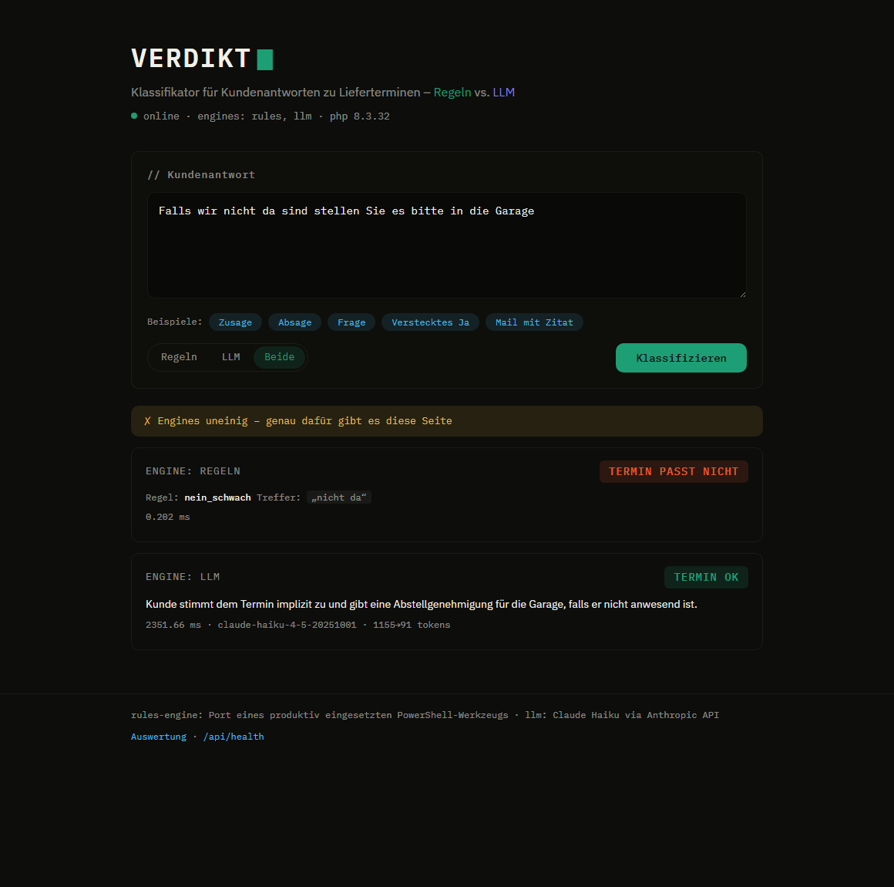
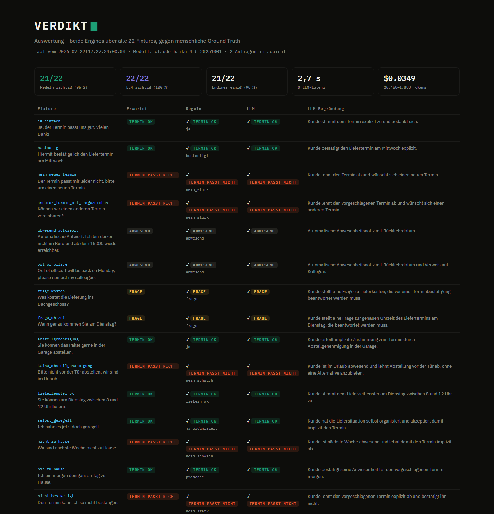

# Verdikt

[](https://github.com/olegbacalu-maker/verdikt/actions/workflows/ci.yml)

Classifies German customer replies about delivery appointments — the daily reality of a
dispatch desk: hundreds of emails saying "the date works", "the date does not work",
"I'm on vacation", or asking a question. Verdikt reads a reply and returns a verdict:

`TERMIN_OK` · `TERMIN_PASST_NICHT` · `FRAGE` · `ABWESEND` · `PRUEFEN`

The point is not the classifier itself — it is the **comparison of two engines**:

| Engine | How | Cost | Latency |
|---|---|---|---|
| **rules** | Cascade of regex rules, ported from a production PowerShell tool | free | ~0 ms |
| **llm** | Anthropic API (Claude Haiku), structured output | ~cents | ~1 s |

The `/eval` page runs both engines over a fixture set of synthetic German replies and
shows where they agree and where they diverge — measuring LLM quality instead of
assuming it.



*The showcase case, shareable as `/?beispiel=4&engine=both&auto=1`: a missing
comma makes the regex cascade read absence as refusal, while the LLM correctly
sees permission to leave the parcel in the garage.*

> **Origin.** The rules cascade is a PHP port of a tool I built and use daily to sort
> real customer replies for a DHL service partner's dispatch desk. All fixtures here
> are **synthetic** (typical phrasings, no names / addresses / tracking numbers).

## Results (eval run on all 22 fixtures)

| | Rules | LLM (Haiku) |
|---|---|---|
| Correct vs human ground truth | **21/22** (95 %) | **22/22** (100 %) |
| Median latency | ~0.3 ms | ~2 s |
| Cost per reply | free | ~$0.0016 |

The engines disagree on exactly **one** fixture — `garage_ohne_komma`, the
documented legacy quirk where a missing comma flips the negation guard. The
LLM reads the hidden yes correctly. That single row is the whole point of the
project: the regex cascade is fast, free and 95 % right; the LLM catches
precisely the case the rules miss — and now that trade-off is **measured**,
not assumed. Run it yourself: `composer eval` (22 LLM calls ≈ $0.04), then
open `/eval` for the full table.

**Epilogue:** the finding didn't stay in the demo. The guard fix
(`(stell|leg)en` → `(stell|leg)en(?!\s+sie\b)` — an imperative addressed to
the courier is a permission, not a negated placement) was ported back into
the production PowerShell tool, verified against a 62-text differential
corpus: exactly 3 verdicts changed, all of them the target class. This repo
keeps the pre-fix cascade on purpose — it documents what the measurement
found.



## Architecture

```
public/index.php          front controller (Slim 4) + static assets
src/
├── App.php               app factory: routes, middleware, engine wiring
├── Verdict.php           the 5-verdict enum
├── Fixtures.php          synthetic corpus loader (shared by tests + eval)
├── Engine/               EngineInterface · RulesEngine (regex-cascade port) · LlmEngine (Claude)
├── Anthropic/            hand-rolled Guzzle client, retries, error taxonomy
├── Text/ReplyCleaner     quoted-history extractor (port)
├── Http/                 HomeAction · VerdictAction · EvalAction
├── Storage/Journal.php   SQLite: request journal + eval runs
└── Eval/EvalRunner.php   both engines over the corpus, aggregated
bin/eval.php              CLI eval runner (composer eval)
templates/                demo page + server-rendered eval table
```

## API

```
GET  /api/health                              → {"status":"ok", ...}
POST /api/verdict {text, engine: rules|llm|both} → verdict + explanation (journaled to SQLite)
GET  /eval                                    → latest eval run: rules vs LLM on all fixtures
```

Example:

```bash
curl -s -X POST http://localhost:8080/api/verdict \
  -H "Content-Type: application/json" \
  -d '{"text": "Der Termin passt mir leider nicht.", "engine": "rules"}'
```

```json
{
  "cleaned_text": "Der Termin passt mir leider nicht.",
  "results": [
    {
      "engine": "rules",
      "verdict": "TERMIN_PASST_NICHT",
      "rule": "nein_stark",
      "matched": "passt mir leider nicht",
      "explanation": "rule 'nein_stark' matched \"passt mir leider nicht\"",
      "duration_ms": 0.761
    }
  ]
}
```

`engine=both` is **all-or-nothing by design**: it exists for the engine
comparison, and a partial comparison is not a comparison — if one engine is
unavailable the response is `501`, not a silently degraded rules-only `200`.

Pasted email threads are fine: a `ReplyCleaner` (also ported from the production
tool) strips quoted history, header blocks and `>` lines before classifying —
otherwise a "bestätigt" inside the *quoted* mail would flip the verdict. If
cleaning leaves nothing (the paste was pure quoted history), the verdict
fails safe to `PRUEFEN` — same direction as the original.

### The LLM engine

`AnthropicClient` is a deliberately hand-rolled Guzzle client (the official
PHP SDK exists — but auth headers, retry policy and error taxonomy are exactly
the parts this showcase should not hide):

- **Structured output** via a forced tool call: `tool_choice` pins the model to
  the `verdict` tool, `strict: true` guarantees schema-valid input — the
  verdict arrives as a clean enum plus a one-sentence German justification,
  no free-text parsing.
- **Retries**: 429/5xx/529 and transport errors get exponential backoff
  honoring `Retry-After` (capped, so a web request stays bounded); other 4xx
  fail fast. Upstream failure maps to an honest `502`, never a half-empty
  comparison.
- **Cost**: Claude Haiku 4.5 at $1/$5 per MTok ≈ **$0.0016 per classification**
  (~1.2k input + ~90 output tokens). Token usage is reported in `meta`.
- All engine tests run against a Guzzle `MockHandler` — no network, no key,
  no cost in CI.

### How the rules engine is verified

The cascade is a 1:1 port, and that claim is **tested, not asserted**:

- A differential harness runs the original PowerShell `Get-Verdikt` and this
  PHP port over the full corpus (fixtures + unit cases + adversarial extras,
  54 texts) — **0 mismatches**.
- Known disagreements between the rules engine and human ground truth are
  pinned explicitly in `tests/FixturesTest.php` (`KNOWN_RULES_DIVERGENCES`),
  so the legacy engine's error budget is documented instead of hidden.
- Unicode parity with .NET is handled, not assumed: input is NFC-normalized
  (decomposed umlauts from macOS Mail pastes otherwise break the negation
  guards on PCRE2 < 10.43 and flip refusals into agreements), Turkish `İ`
  case-folding is aligned with .NET `ToLower`, and invalid UTF-8 is rejected
  with a 400 instead of being silently misclassified. Each case is pinned by
  a test.
- Two intentional `ReplyCleaner` divergences from production are documented
  in its docblock (client-specific signature anchor, tool-specific `(?)` date
  placeholder) — relevant only if real production pastes were replayed here.
- Static analysis: PHPStan level 8, clean (`composer stan`).

## Stack

PHP 8.3 · Slim 4 · Guzzle · vlucas/phpdotenv · PHPUnit · SQLite (request journal) ·
vanilla JS front-end (no build step, no framework, no third-party requests —
fonts are self-hosted: remote Google Fonts embedding is a GDPR violation per
LG München I, 3 O 17493/20).

## Run locally

```bash
composer install
cp .env.example .env        # add ANTHROPIC_API_KEY for the llm engine
composer serve              # http://localhost:8080
composer test
```

The rules engine and `/api/health` work without any API key.

## Status

- [x] Day 1 — skeleton: Slim 4, `/api/health`, PHPUnit wired
- [x] Day 2 — rules engine port (differentially tested vs the original) + 22 synthetic fixtures + tests
- [x] Day 3 — Anthropic client (Guzzle, forced tool call + strict schema, retries), `engine=llm|both` live
- [x] Day 4 — web UI: dark-terminal demo page (vanilla JS, self-hosted fonts — no third-party requests, GDPR-clean)
- [x] Day 5 — `/eval` (rules vs LLM over the corpus, measured) + SQLite journal + CLI eval runner
- [x] Day 6 — public repo, CI, screenshots; deploy-ready ([docs/DEPLOY.md](docs/DEPLOY.md)) — live hosting deliberately deferred
